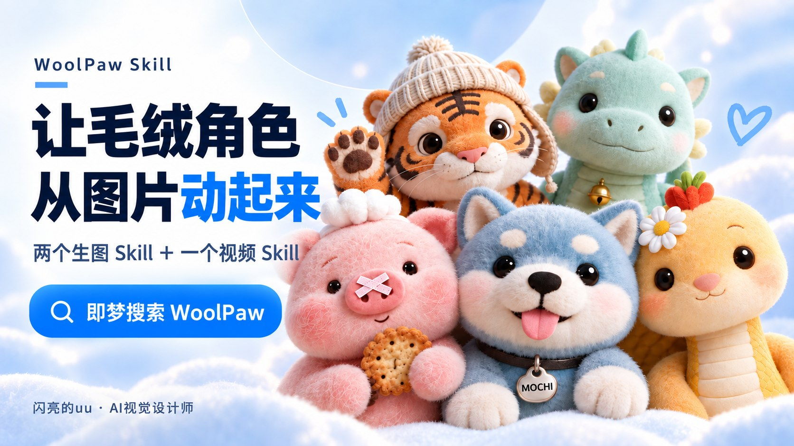
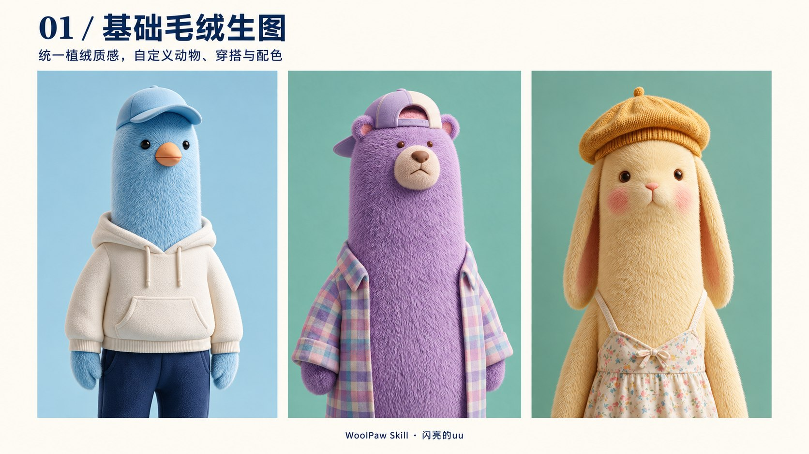
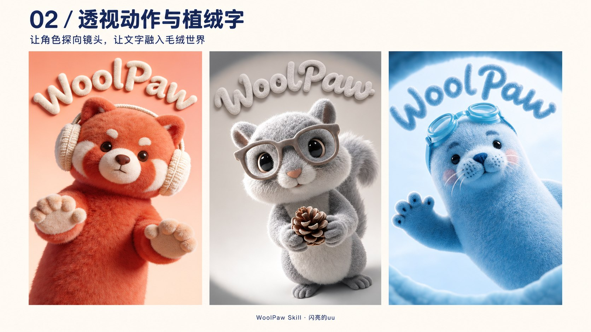
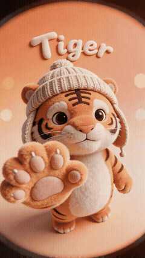

<p align="center"></p>

# WoolPaw Skill

**让毛绒角色，从图片动起来。** 两个生图 Skill ＋ 一个视频 Skill，覆盖系列角色、透视动作与植绒文字、5 秒动感开场。

> **WoolPaw 已上线即梦技能，在即梦技能中搜索 `WoolPaw` 即可找到。**  
> 上线信息由作者确认。作者：**闪亮的uu** · [GitHub](https://github.com/uu525)

**[下载三个 Skill（ZIP）](https://raw.githubusercontent.com/uu525/woolpaw-skills/main/downloads/woolpaw-skills-v1.0.1.zip)** · **[完整中文教程](docs/QUICKSTART.md)** · **[版本记录](CHANGELOG.md)**

## 选一个适合你的 Skill

| Skill | 可以做什么 | 需要准备 | 文件 |
| --- | --- | --- | --- |
| 基础版 | 统一植绒质感，自定义动物、配色与穿搭 | 文字描述：动物、颜色、服装、动作；无需上传图片 | [下载 .md](https://raw.githubusercontent.com/uu525/woolpaw-skills/main/skills/basic/WoolPaw-毛绒-简单版.md) |
| 进阶版 | 夸张透视动作、定制植绒文字、渐变光斑背景 | 文字描述：角色、角度、动作、植绒字内容；无需上传图片 | [下载 .md](https://raw.githubusercontent.com/uu525/woolpaw-skills/main/skills/perspective/WoolPaw-毛绒-加透视动作加定制植绒字装饰.md) |
| 视频版 | 角色大幅动作、文字逐显、5 秒动感开场 | 上传已经生成好的、清晰完整的首帧图 | [下载 .md](https://raw.githubusercontent.com/uu525/woolpaw-skills/main/skills/video/WoolPaw-毛绒-动感视频-炫技动作版.md) |

## 两种开始方式

**即梦直接使用：** PC 端进入技能页 → 搜索 **WoolPaw** → 使用对应技能。**两个生图 Skill 直接输入文字描述，无需上传参考图；只有视频 Skill 需要上传已经生成好的首帧图。**

**下载后自行导入：** 下载上方 ZIP 并解压 → 选择对应 `.md` 文件 → 在**即梦 PC 端技能页**或**豆包技能窗口**导入 → 生图直接描述需求；视频上传生成好的首帧图并描述动作。

准备好平台账号和相应生成权限／额度。生图只需文字需求；做视频时再准备生成好的首帧图。下载包不包含生成模型、会员或 API 密钥。导入入口由作者提供，本次发布未重新实测平台内导入与生成；具体界面和可选模型以平台当前功能为准。

## 作品展示

### 01 · 基础毛绒生图



保持清晰植绒纹理、长条角色形态和低饱和配色，制作不同动物与穿搭的系列图。

**描述建议：动物＋颜色＋服装／配饰＋基础动作。** 不确定的部分可以直接让 AI 自己想象，无需上传参考图。

[查看作者原始成品：小鸟](assets/examples/basic-bird.jpg) · [小熊](assets/examples/basic-bear.jpg) · [垂耳兔](assets/examples/basic-rabbit.jpg)

```text
使用「简单动作」Skill，帮我设计一只奶黄色毛绒垂耳兔，
戴针织贝雷帽、穿碎花裙，向镜头挥手。
保持清晰植绒质感和低饱和配色，背景与其他细节请自由发挥。
```

### 02 · 透视动作与植绒字



让角色朝镜头探出，为自己的文字设计同材质的立体植绒字，搭配柔和渐变与圆形光斑。

**描述建议：角色形象＋镜头角度＋动作＋准确文字＋背景氛围。** 可以纯文字直接创作，无需上传角色图。

[查看作者原始成品：红色小熊](assets/examples/perspective-bear.jpg) · [松鼠](assets/examples/perspective-squirrel.jpg) · [海豹](assets/examples/perspective-seal.jpg)

```text
使用「加透视加字体」Skill，设计一只奶黄色毛绒垂耳兔，
戴针织贝雷帽、穿碎花裙，以高角度鱼眼俯拍，让它向镜头递出小花。
背景加入植绒艺术字“Rabbit”，搭配柔和渐变与圆形光斑。
```

封面与两张宣传展示图基于作者已有作品，经 AI 辅助排版制作；点击上方链接可查看仅为网页加载缩放压缩、未经 AI 重绘的作者成品。示例指令用于演示，不代表这些历史成品的完整生成记录。

### 03 · 5 秒动感开场

**先上传已经生成好的首帧图，再描述视频时长、角色动作和结束方式。**

<p align="center"><a href="assets/video/intro.mp4"></a></p>

**[查看完整 MP4](assets/video/intro.mp4)** · [查看视频静帧](assets/video/poster.jpg)

预览来自作者已有成品视频，GIF 无声且已降低尺寸和帧率；MP4 保留原片完整时长，经网页播放压缩，不是本次重新生成的结果。

```text
我已上传生成好的首帧图。使用「登场视频」Skill，为这只小兔子设计 5 秒登场动画。
转身、挥手，耳朵跟着轻轻摆动，最后尽量回到首帧图的姿势与构图并定格。
```

推荐流程：**简单动作 → 加透视加字体 → 登场视频**。也可以按需单独调用。以上提示词建议根据作者《WoolPaw Skill 使用说明》整理，并按作者最新说明明确了生图无需参考图。

## 使用提示

- 三个 Skill 原文完整保留。原文模型名和参数是作者预设，实际以平台可选项为准；见[参数与常见问题](docs/QUICKSTART.md)。
- 原文中的工具名称依赖平台实际提供的生成能力，下载文件本身不会安装模型或工具。
- “100%保留”“精准定格”等为创作目标，并非效果承诺；文字、肢体和角色一致性需要人工检查。
- 两个生图 Skill 无需上传参考图；有喜欢的图片或需要延续已有形象时可自愿提供。视频 Skill 必须上传生成好的首帧图。第三方参考素材不随仓库提供。

## 授权与联系

Skill 文本、教程与脚本采用 **[MIT 许可](LICENSE)**。**图片、视频、GIF 和展示图仅供展示学习**，商用或公开再分发请先联系作者，详见 [视觉素材使用说明](ASSETS-LICENSE.md)。

作者 **闪亮的uu** · [GitHub 联系入口](https://github.com/uu525) · [反馈问题](https://github.com/uu525/woolpaw-skills/issues)
